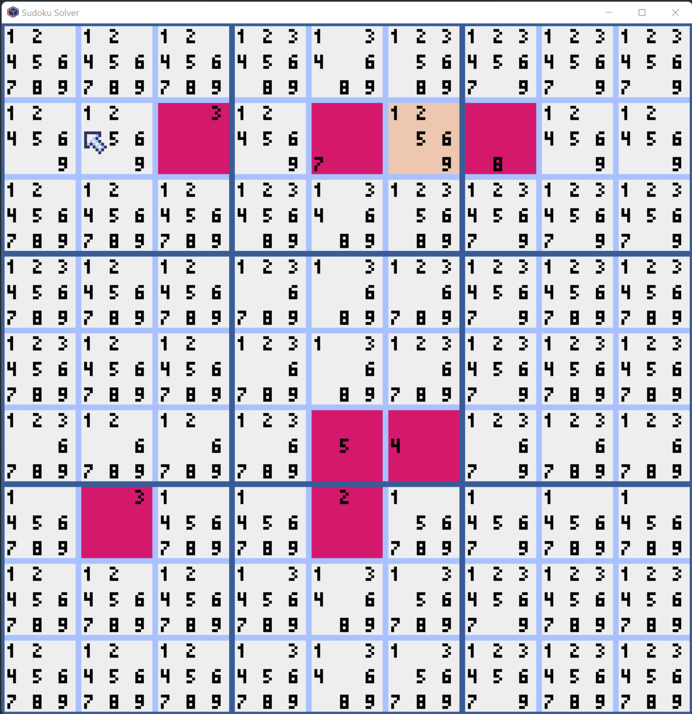

# Sudoku Solver

A program for solving Sudoku puzzles using a Wave Function Collapse algorithm.



Loosely based on [Superpositions, Sudoku, the Wave Function Collapse algorithm.](https://youtu.be/2SuvO4Gi7uY)

## How To Play

- `Return`: Solve puzzle instantly
- `Click`: Collapse cell to selected number
- `R`: Reset board to blank state
- `S`: Toggle automatic solving over time
- `Q`: Quit game

## Installation

```
poetry install
```

## Run

```
python sudoku-solver.py
```
